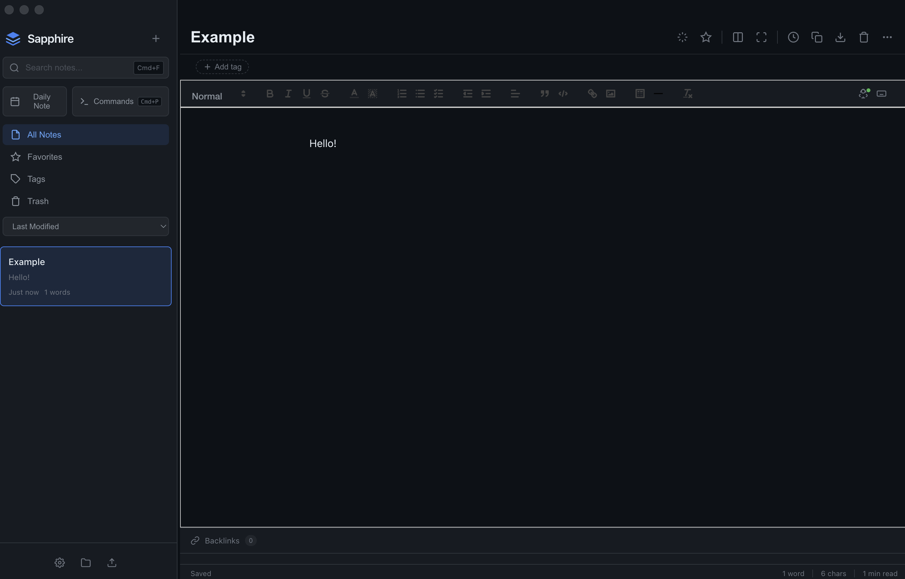

# Sapphire

A private, local-first note-taking application with AI integration, built with Electron.



## Features

### Core Features
- **Rich Text Editing** - Full formatting support with Quill editor
- **Local-First** - All notes stored locally, never leave your device
- **Dark Mode** - Beautiful geometric dark theme with animated backgrounds
- **Tags & Organization** - Organize notes with tags and favorites
- **Version History** - Automatic backups with restore capability
- **Templates** - Quick-start templates for common note types
- **Export** - Export to HTML, Markdown, Plain Text, or JSON
- **Split View** - View two notes side by side
- **Command Palette** - Quick access to all commands (Cmd+P)
- **Backlinks** - See which notes link to the current note
- **Daily Notes** - Quick access to today's note (Cmd+D)

### Productivity Features
- **Pomodoro Timer** - Built-in focus timer with customizable sessions and break times
- **Writing Statistics** - Track total notes, words, reading time, and tags
- **Writing Goals** - Set daily word goals and track weekly progress
- **Activity Heatmap** - Visualize your writing activity over the past 28 days
- **Note Graph** - Interactive force-directed graph visualization of all your notes
- **Quick Capture** - Floating widget to quickly jot down thoughts (Cmd+Shift+N)

### Focus Features
- **Focus Mode** - Distraction-free writing environment (Cmd+Shift+F)
- **Reading Mode** - Clean, distraction-free reading view (Cmd+R)
- **Typewriter Mode** - Keep your cursor centered while writing
- **Toggle Sidebar** - Hide the sidebar for maximum writing space (Cmd+\)

### Note Linking
- **Wiki-style Links** - Type `[[` to autocomplete and link to other notes
- **Note Graph** - Visualize connections between your notes
- **Backlinks Panel** - See which notes reference the current note

### Customization
- **Color Themes** - 6 accent colors: Blue, Purple, Pink, Cyan, Orange, Green
- **Configurable Font Size** - Adjust editor font size to your preference
- **Configurable Line Height** - Adjust line spacing for comfortable reading

### AI Features (Powered by Ollama)

- **Summarize** - Get concise summaries of your notes
- **Expand** - Elaborate on selected text
- **Rewrite** - Improve clarity and flow
- **Simplify** - Make text easier to understand
- **Professional/Casual** - Adjust tone
- **Fix Grammar** - Correct spelling and grammar
- **Translate** - Translate to Spanish, French, German, Chinese, Japanese
- **Suggest Tags** - AI-generated tag suggestions
- **Suggest Title** - AI-generated title suggestions
- **Chat** - Ask questions about your notes

## Installation

### Pre-built Binaries

Download the latest release for your platform from the [Releases](https://github.com/Dexxzy/sapphire/releases) page.

### Build from Source

1. Clone the repository:
```bash
git clone https://github.com/Dexxzy/sapphire.git
cd sapphire
```

2. Install dependencies:
```bash
npm install
```

3. Run in development mode:
```bash
npm start
```

4. Build for distribution:
```bash
# Build for current platform
npm run build

# Build for specific platform
npm run build:mac
npm run build:win
npm run build:linux

# Build for all platforms
npm run dist
```

## AI Setup (Optional)

Sapphire integrates with [Ollama](https://ollama.ai/) for local AI features.

1. Install Ollama:
```bash
# macOS
brew install ollama

# Or download from https://ollama.ai/
```

2. Start Ollama:
```bash
ollama serve
```

3. Pull a model:
```bash
ollama pull gemma3:latest
# or any other model: llama3.2, mistral, codellama, etc.
```

4. Open Sapphire and press `Cmd+J` to open the AI panel

## Keyboard Shortcuts

### General
| Shortcut | Action |
|----------|--------|
| `Cmd+N` | New note |
| `Cmd+S` | Save note |
| `Cmd+F` | Search notes |
| `Cmd+P` | Command palette |
| `Cmd+D` | Daily note |
| `Cmd+J` | Toggle AI panel |
| `Cmd+/` | Show keyboard shortcuts |
| `Escape` | Close modals/panels |

### View
| Shortcut | Action |
|----------|--------|
| `Cmd+Shift+F` | Toggle focus mode |
| `Cmd+R` | Reading mode |
| `Cmd+\` | Toggle sidebar |
| `Cmd+Shift+N` | Quick capture |

### Editing
| Shortcut | Action |
|----------|--------|
| `Cmd+B` | Bold |
| `Cmd+I` | Italic |
| `Cmd+U` | Underline |
| `Cmd+K` | Insert link |
| `[[` | Link to note (autocomplete) |

## Data Storage

Your notes are stored locally in:
- **macOS**: `~/Library/Application Support/sapphire/`
- **Windows**: `%APPDATA%/sapphire/`
- **Linux**: `~/.config/sapphire/`

## Tech Stack

- [Electron](https://www.electronjs.org/) - Cross-platform desktop framework
- [Quill](https://quilljs.com/) - Rich text editor
- [Ollama](https://ollama.ai/) - Local AI inference

## Privacy

Sapphire is designed with privacy in mind:
- All notes are stored locally on your device
- No accounts, no cloud sync, no telemetry
- AI features use local Ollama (no data sent to external servers)

## License

MIT License - see [LICENSE](LICENSE) for details.

## Contributing

Contributions are welcome! Please feel free to submit a Pull Request.

1. Fork the repository
2. Create your feature branch (`git checkout -b feature/amazing-feature`)
3. Commit your changes (`git commit -m 'Add some amazing feature'`)
4. Push to the branch (`git push origin feature/amazing-feature`)
5. Open a Pull Request
